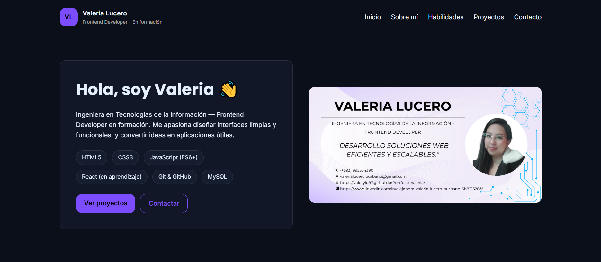

# 🌐 Portafolio Profesional — Valery Lucero

Este proyecto es mi **landing page / portafolio personal**, diseñado para presentar mis habilidades como desarrolladora en Tecnologías de la Información. Incluye información sobre mí, mis proyectos, mi experiencia, mis habilidades técnicas y una sección de contacto.

🔗 **Demo online:**  
👉 https://valerylu97.github.io/Portfolio_Valeria/

---

## ✨ Características principales

- Diseño **moderno estilo tech**
- Totalmente **responsive**
- Animaciones suaves con CSS y JavaScript
- Sección de proyectos
- Sección sobre mí
- Paleta de colores profesional
- Código organizado en archivos separados (HTML, CSS, JS)

---

## 🛠️ Tecnologías utilizadas

<p>
 
  
  
 
</p>      

---

## 📂 Estructura del proyecto

```bash
📁 Portfolio_Valeria
 ├── 📄 index.html
 ├── 📄 style.css
 ├── 📄 main.js
 ├── 📁 assets
 │     ├── images/
 │     └── icons/
 └── 📄 README.md
```
---
## 🚀 Cómo ejecutar el proyecto
**1️⃣ Clonar el repositorio**
```bash
git clone https://github.com/Valeryu97/Portfolio_Valeria.git
```
**2️⃣ Abrir el proyecto**
Abre el archivo
```bash
index.html
```
directamente en el navegador.

Opcionalmente, puedes usar un servidor local con VSCode:
1. Instala la extensión Live Server
2. Clic derecho → Open with Live Server

---

## 🖼️ Vista previa
<p align="center">
  
</p>

---

## 📬 Contacto
**Valeria Lucero**

📧 Email: <a href="mailto:valerialucero.burbano@gmail.com">valerialucero.burbano@gmail.com</a>

🔗 LinkedIn: https://www.linkedin.com/in/alejandra-valeria-lucero-burbano-6b8215283/

---
## 📝 Licencia

Proyecto de uso libre bajo la licencia MIT.
